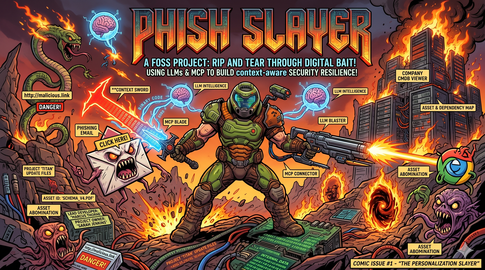
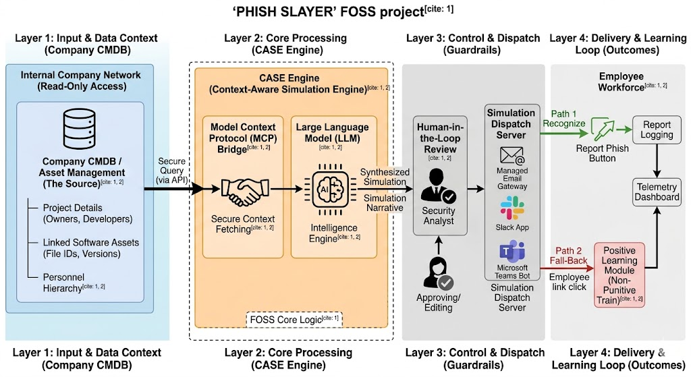

# PHISH SLAYER - Open-Source Context-Aware Phishing Simulation Framework

> **SEO Summary:** PHISH SLAYER is an open-source, context-aware phishing simulation framework that uses Large Language Models (LLMs), the Model Context Protocol (MCP), and secure CMDB integrations to deliver hyper-personalized security awareness training, spear-phishing simulations, and measurable cyber resilience outcomes.

**Keywords:** phishing simulation, spear-phishing simulation, security awareness training, cyber resilience, model context protocol, MCP, CMDB integration, AI security training, open-source security platform, human-in-the-loop security

## Primary Use Cases

- Build context-aware phishing simulation campaigns using CMDB metadata.
- Run spear-phishing awareness programs with human-in-the-loop ethical review.
- Measure security behavior improvements with telemetry-driven KPIs (CTR, TTR, reporting rates).
- Integrate security simulations with enterprise tools like ServiceNow, Jira Service Management, Slack, and Microsoft Teams.
- Deploy an open-source alternative to commercial phishing simulation platforms with customizable LLM backends.

## Contributor Discovery Tags

security awareness platform, phishing simulation framework, MCP server architecture, LLM prompt engineering for security, CMDB connector development, SOC training automation, red-team simulation tooling, blue-team resilience analytics, open-source cybersecurity project

## Documentation Map

- [Project Architecture (MCP)](MCP_ARCHITECTURE.md) - full MCP-native system design, tools/resources/prompts model, and security controls.
- [Simulation Scenario Examples](EXAMPLES.md) - high-fidelity context-aware phishing and social engineering simulation examples.
- [Project Proposal (this document)](README.md) - vision, roadmap, stack, and implementation strategy.

## Table of Contents

1. [Executive Summary](#executive-summary)
2. [Problem Statement](#1-problem-statement)
3. [Existing Systems and Limitations](#2-existing-systems--limitations)
4. [Proposed System: PHISH SLAYER](#3-proposed-system-phish-slayer)
5. [System Architecture](#4-system-architecture)
6. [Technology Stack](#5-technology-stack)
7. [Advantages and Value Proposition](#6-advantages--value-proposition)
8. [Implementation Roadmap](#7-implementation-roadmap)
9. [Project Team and Expertise](#8-project-team--expertise)
10. [Success Metrics and KPIs](#9-success-metrics--key-performance-indicators-kpis)
11. [Future Enhancements](#10-future-enhancements)
12. [Related Technical Documents](#related-technical-documents)
13. [FAQ (Implementation and Security)](#faq-implementation-and-security)

## FAQ (Implementation and Security)

### Is PHISH SLAYER production-ready today?
PHISH SLAYER is currently positioned as a project proposal and architecture blueprint. The phased roadmap in this document outlines the path from foundation and connector development to pilot deployment and open-source release.

### What data is sent to the LLM?
The design uses context minimization: only necessary professional metadata is passed to generation workflows. Sensitive content and PII are intentionally excluded, masked, or redacted based on policy and consent controls.

### How is consent enforced?
Consent is enforced through auditable access workflows and immutable tracking references. In the MCP design, every sensitive data access action is tied to explicit approval context and compliance controls.

### Does PHISH SLAYER support human review before sending simulations?
Yes. The architecture includes a mandatory human-in-the-loop review gate where security analysts can approve, edit, or reject AI-generated simulation narratives before dispatch.

### Which systems can PHISH SLAYER integrate with?
Planned integrations include CMDB and service-management ecosystems such as ServiceNow and Jira Service Management, with dispatch support for email, Slack, and Microsoft Teams.

### Where can I see protocol details and realistic scenarios?
For protocol and security design, see [MCP_ARCHITECTURE.md](MCP_ARCHITECTURE.md). For campaign-style examples, see [EXAMPLES.md](EXAMPLES.md).

## **Project Proposal: PHISH SLAYER**

**An Open-Source Framework for Context-Aware Security Resilience**

## **Executive Summary**

Traditional security awareness training relies on static, generic templates that fail to prepare employees for modern, highly targeted cyber-attacks. **PHISH SLAYER** is a Free and Open-Source Software (FOSS) project designed to bridge this gap. By integrating Large Language Models (LLMs) with the Model Context Protocol (MCP) to securely query internal Configuration Management Databases (CMDB), PHISH SLAYER automates the creation of hyper-personalized, context-aware social engineering simulations. This project aims to democratize enterprise-grade spear-phishing defense, transforming passive compliance training into active cyber resilience.

For the full protocol-level blueprint, see [MCP Architecture](MCP_ARCHITECTURE.md). For practical simulation narratives, see [Scenario Examples](EXAMPLES.md).

---

## **1\. Problem Statement**

The human element remains the most vulnerable layer in enterprise security. However, the methods used to train this layer are severely outdated:

* **Pattern Fatigue:** Employees quickly learn to identify generic phishing templates (e.g., "Password Expired," "HR Policy Update"), leading to a false sense of security and a "check-the-box" mentality.  
* **The Spear-Phishing Reality:** Modern threat actors do not use generic templates. They utilize Open Source Intelligence (OSINT) and compromised internal data to craft highly specific attacks referencing actual projects, assets, and colleagues.  
* **The Scaling Bottleneck:** Security teams lack the bandwidth to manually research and craft hyper-personalized spear-phishing simulations for every department, team, or individual in an organization.

## **2\. Existing Systems & Limitations**

Current commercial and open-source phishing simulation platforms suffer from critical limitations:

* **Static Template Libraries:** They rely on predefined scenarios that lack contextual relevance to the user’s actual daily workflow.  
* **Data Isolation:** Existing tools do not natively interface with internal asset management or HR systems, meaning they cannot dynamically leverage real-time company metadata.  
* **Punitive Focus:** Many systems flag employees who "fail" without providing immediate, constructive, and scenario-specific learning, fostering resentment rather than resilience.

## **3\. Proposed System: PHISH SLAYER**

PHISH SLAYER introduces the **Context-Aware Simulation Engine (CASE)**. Instead of relying on templates, the system dynamically generates scenarios based on an employee's real-time professional environment.

To review concrete simulation outputs generated from this approach, visit [EXAMPLES.md](EXAMPLES.md).

The core philosophy is to use the attackers' weapons—**Intelligence and Context**—to build a resilient workforce. By referencing real project IDs, actual linked software assets, and verifiable personnel hierarchies, the simulations test critical thinking and verification protocols rather than simple pattern recognition.

## **4\. System Architecture**

The architecture is divided into four secure, modular layers:

### **Layer 1: Input & Data Context (The Source)**

* **CMDB Integration:** The system connects to the organization's Configuration Management Database or Application Lifecycle Management tools.  
* **Secure Querying:** Using read-only API access, it retrieves "Contextual Anchors" (e.g., active Project IDs, Lead Developers, specific file names like `schema_v4.pdf`).

### **Layer 2: Core Processing (The CASE Engine)**

* **Model Context Protocol (MCP) Bridge:** Acts as the secure, standardized connective tissue between the internal data source and the AI intelligence.  
* **LLM Intelligence:** A Large Language Model processes the contextual anchors and synthesizes a bespoke communication (email, Slack, or Teams message) that perfectly mimics the company’s internal professional tone.

The protocol-level design and JSON-RPC MCP primitives are documented in [MCP_ARCHITECTURE.md](MCP_ARCHITECTURE.md).

### **Layer 3: Control & Dispatch (The Guardrails)**

* **Human-in-the-Loop:** A mandatory review gate where a Security Analyst approves or edits the AI-generated narrative to ensure ethical compliance and professional boundaries.  
* **Simulation Dispatch Server:** Routes the approved simulation through managed email gateways or collaboration app integrations.

### **Layer 4: Delivery & Learning Loop (The "Glory Kill")**

* **Telemetry Dashboard:** Tracks engagement, recognition, and failure rates across specific departments.  
* **Positive Learning Module:** If an employee clicks a malicious link, they are instantly redirected to a brief, non-punitive, interactive module that deconstructs the specific context-aware attack they just experienced.

## **5\. Technology Stack**

As a FOSS project, the stack emphasizes modularity and community-driven standards:

* **Intelligence:** Modular LLM support (e.g., Meta Llama 3, Anthropic Claude, OpenAI GPT-4) to allow organizations to use self-hosted or cloud-based models.  
* **Data Integration Bridge:** Model Context Protocol (MCP) for secure, standardized tool usage and data fetching.  
* **Target CMDB Integrations:** Initial API connectors built for major platforms like ServiceNow, Jira Service Management, and Device42.  
* **Backend / Dispatch:** Python or Node.js core logic; SMTP relays for email; Webhooks/APIs for Slack and Microsoft Teams integration.

## **6\. Advantages & Value Proposition**

* **Hyper-Personalization at Scale:** Automates the creation of thousands of unique, context-rich scenarios without requiring an army of security analysts.  
* **Enhanced Security & Privacy:** The MCP bridge is read-only. The LLM only receives necessary metadata (professional identifiers), ensuring no Personally Identifiable Information (PII) or sensitive intellectual property is ever stored in the model's training memory.  
* **Cost-Effective (FOSS):** Eliminates vendor lock-in and expensive per-seat licensing fees associated with legacy simulation platforms.  
* **Cultural Shift:** Transforms security training from an annoying compliance task into an engaging, intellectually stimulating challenge that fosters a proactive defense culture.

## **7\. Implementation Roadmap**

* **Phase 1: Foundation (Months 1-2):** Develop the core CASE Engine logic and the first set of MCP connectors for standard CMDB environments.  
* **Phase 2: Narrative & Guardrails (Months 3-4):** Engineer the LLM prompt structures for specific corporate tones and finalize the Human-in-the-Loop review UI.  
* **Phase 3: The Learning Loop (Months 5-6):** Develop the dispatch mechanisms and the interactive, positive learning modules for "failed" tests.  
* **Phase 4: Pilot & FOSS Release (Month 7+):** Run internal pilots with highly technical departments (e.g., DevOps), refine based on telemetry, and officially launch the open-source repository to the community.

## **8\. Project Team & Expertise**

The successful execution of PHISH SLAYER requires a multidisciplinary team combining deep expertise in cyber security, modern software architecture, and AI/ML model deployment.

| Role | Key Responsibilities | Required Expertise |
| :---- | :---- | :---- |
| **Project Lead / Security Architect** | Overall project strategy, FOSS governance, securing the MCP bridge and CMDB integrations. | Enterprise Security, Penetration Testing, Risk Management, Python. |
| **AI/ML Engineer** | Developing and optimizing the LLM prompt structures, ensuring contextual synthesis is realistic and secure. | Prompt Engineering, Natural Language Processing, LLM deployment (e.g., Llama 3, Claude). |
| **Full Stack Developer** | Building the Human-in-the-Loop review UI, Telemetry Dashboard, and positive learning modules. | Svelte/React (Frontend), Node.js/Java (Backend), Database integration (e.g., PostgreSQL). |
| **DevOps / Release Manager** | Setting up secure CI/CD pipelines, managing containerization (Docker/Kubernetes), and managing the public FOSS repository. | Cloud Infrastructure (AWS/Azure/GCP), CI/CD, Infrastructure as Code (Terraform). |

## **9\. Success Metrics & Key Performance Indicators (KPIs)**

The success of PHISH SLAYER will be measured not by the number of "failures," but by the verifiable increase in employee resilience and security awareness maturity.

| Category | KPI | Target Goal (Post-Pilot) | Measurement Method |
| :---- | :---- | :---- | :---- |
| **Efficacy** | Reduction in Click-Through Rate (CTR) for context-aware simulations. | 50% Reduction over 6 months | Telemetry Dashboard tracking compared to baseline generic simulations. |
| **Resilience** | Time to Report (TTR) a suspected malicious message. | Decrease TTR by 30% | Tracking timestamp from simulation dispatch to employee action (report/block). |
| **Adoption** | Number of deployed organizations and active contributors to the FOSS project. | 5+ Enterprise Deployments; 10+ Active Community Contributors | GitHub repository metrics and community engagement reports. |
| **Security** | Zero instances of PII/Sensitive Data exposure via the LLM/MCP. | 100% Compliance | Formal security audit and penetration testing of the MCP layer. |

## **10\. Future Enhancements**

Following the initial FOSS release, future iterations of PHISH SLAYER will focus on expanding its simulation capabilities and integration footprint.

* **Multi-Channel Simulations:** Expanding beyond email to include voice (vishing) and SMS (smishing) simulations, integrating context from HR systems to identify personal contact vectors.  
* **Automated Remediation Workflows:** Building connectors to ticketing systems (e.g., Jira, Zendesk) to automatically create incident response tickets when a user reports a successful simulation.  
* **Dynamic Difficulty Scaling:** Implementing an adaptive system that increases the contextual complexity and subtlety of simulations based on an individual or department's consistent success rate.

---

## Related Technical Documents

- [MCP_ARCHITECTURE.md](MCP_ARCHITECTURE.md): Detailed universal MCP application architecture for PHISH SLAYER, including tools, resources, prompts, security controls, and JSON-RPC execution flows.
- [EXAMPLES.md](EXAMPLES.md): Realistic context-aware spear-phishing and social engineering simulation examples covering cloud, CI/CD, and internal collaboration attack patterns.

If you are implementing the platform, start with [MCP_ARCHITECTURE.md](MCP_ARCHITECTURE.md). If you are designing training campaigns, start with [EXAMPLES.md](EXAMPLES.md).
